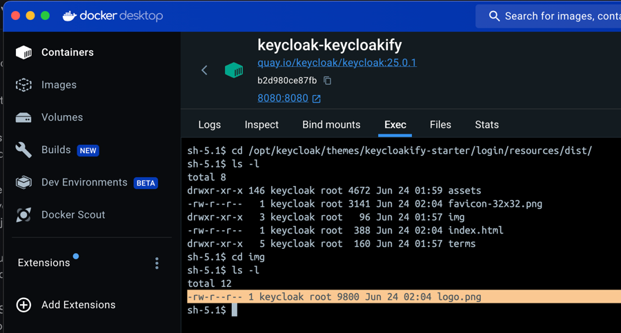

# Adding your Logo


NOTE: You can very well change the logo using only CSS without having to ejecting the template. There's a demo in [this video](https://youtu.be/Nkoz1iD-HOA?si=6DLF7iAPTeX-pkNP). &#x20;


Let's say you want to put the logo of your company on every pages of the theme.

First you'd eject the Template:

```bash
npx keycloakify eject-page # Select login -> Template.tsx
```

<figure><figcaption></figcaption></figure>

This will create a **src/login/Template.tsx** file in your project.

Let's use this placeholder for the demo: [logo.png](https://github.com/keycloakify/keycloakify/releases/download/v0.0.1/logo.png) and save it in **src/login/assets/logo.png**.

Now we can use the asset in our component: &#x20;



<pre class="language-tsx" data-title="src/login/Template.tsx"><code class="lang-tsx"><strong>import logoPngUrl from "./assets/logo.png";
</strong>// ...
&#x3C;div className={kcClsx("kcLoginClass")}>
    &#x3C;div id="kc-header" className={kcClsx("kcHeaderClass")}>
        &#x3C;div id="kc-header-wrapper" className={kcClsx("kcHeaderWrapperClass")}>
<strong>            {/*{msg("loginTitleHtml", realm.displayNameHtml)}*/}
</strong><strong>            &#x3C;img src={logoPngUrl} width={500}/>
</strong>        &#x3C;/div>
    &#x3C;/div>
    {/* ... */}
</code></pre>




```html
<script lang="ts">
  import logoPngUrl from "./assets/logo.png";
  // ...
</script>

<div
  id="kc-header-wrapper"
  class={kcClsx('kcHeaderWrapperClass')}
>
  <!--{ msgStr('loginTitleHtml', realm.displayNameHtml) }-->
  
</div>
```




<pre class="language-typescript" data-title="src/login/template/template.component.ts"><code class="lang-typescript"><strong>import logoPngUrl from '../assets/logo.png';
</strong>
export class TemplateComponent extends ComponentReference {
<strong>  logoPngUrl = logoPngUrl;
</strong>  // ...
</code></pre>

<pre class="language-html" data-title="src/login/template/template.component.html"><code class="lang-html">&#x3C;img
<strong>  [src]="logoPngUrl"
</strong>  alt="logo"
  width="500"
/>
</code></pre>



Result:&#x20;

<figure><figcaption></figcaption></figure>

## Optional: Updating the logo without re-building the theme

Some pepoles want to be able to "hot swipe" the asset in the Keycloak file system without having to re-build the theme and re-deploy it.

To ensure that the assets are located in a predictible location you would use the public/ directory.

Move the file to **public/img/logo.png**.

Then make an absolute import from your component: &#x20;



It's important that you do not simply harcode `src="/img/logo.png"`, or keycloakify won't be able to patch the URL for Keycloak. Use Vite's builtin `import.meta.env.BASE_URL`.

<pre class="language-tsx" data-title="src/login/Template.tsx"><code class="lang-tsx">&#x3C;div className={kcClsx("kcLoginClass")}>
    &#x3C;div id="kc-header" className={kcClsx("kcHeaderClass")}>
        &#x3C;div id="kc-header-wrapper" className={kcClsx("kcHeaderWrapperClass")}>
<strong>            {/*{msg("loginTitleHtml", realm.displayNameHtml)}*/}
</strong><strong>            &#x3C;img src={`${import.meta.env.BASE_URL}img/logo.png`} width={500}/>
</strong>        &#x3C;/div>
    &#x3C;/div>
    {/* ... */}
</code></pre>

Doing this is a good practice in any Vite project (not specially Keycloakify) since it ensure the correctness of your URLs even if you customize the `base` parameter in the your **vite.config.ts**. Hard coding `"/img/logo.png"` only works when base is `"/"` (which is the default)



It's important that you do not simply harcode `src="/img/logo.png"`, or keycloakify won't be able to patch the URL for Keycloak. Use Vite's builtin `import.meta.env.BASE_URL`.


```html
<div
  id="kc-header-wrapper"
  class={kcClsx('kcHeaderWrapperClass')}
>
  <!--{ msgStr('loginTitleHtml', realm.displayNameHtml) }-->
  
</div>
```


Doing this is a good practice in any Vite project (not specially Keycloakify) since it ensure the correctness of your URLs even if you customize the "base" parameter in the your vite.config.ts. Writing "/img/logo.png" only works when base is "/" (which is the default)



<pre class="language-typescript" data-title="src/login/template/template.component.ts"><code class="lang-typescript">export class TemplateComponent extends ComponentReference {
<strong>  BASE_URL = import.meta.env.BASE_URL;
</strong></code></pre>


```html

```




It's important that you do not simply harcode `src="/img/logo.png"`, or keycloakify won't be able to patch the URL for Keycloak. Use `PUBLIC_URL` instead.

<pre class="language-tsx" data-title="src/login/Template.tsx"><code class="lang-tsx">import { PUBLIC_URL } from "keycloakify/PUBLIC_URL";

&#x3C;div className={kcClsx("kcLoginClass")}>
    &#x3C;div id="kc-header" className={kcClsx("kcHeaderClass")}>
        &#x3C;div id="kc-header-wrapper" className={kcClsx("kcHeaderWrapperClass")}>
<strong>            {/*{msg("loginTitleHtml", realm.displayNameHtml)}*/}
</strong><strong>            &#x3C;img src={`${PUBLIC_URL}/img/logo.png`} width={500}/>
</strong>        &#x3C;/div>
    &#x3C;/div>
    {/* ... */}
</code></pre>

NOTE: You can see PUBLIC\_URL as an equivalent of `process.env.PUBLIC_URL` that will work inside and outside of Keycloak.



If you ever need to SSH into the Keycloak server and hot swipe the image you can find it at

**/opt/keycloak/themes/**[**\<name of your theme>**](../features/compiler-options/themename.md)**/login/resources/dist/img/logo.png**

<figure><figcaption><p>Inspecting the Docker Keycloak docker image file system we can find the logo.png at the expected location.</p></figcaption></figure>

