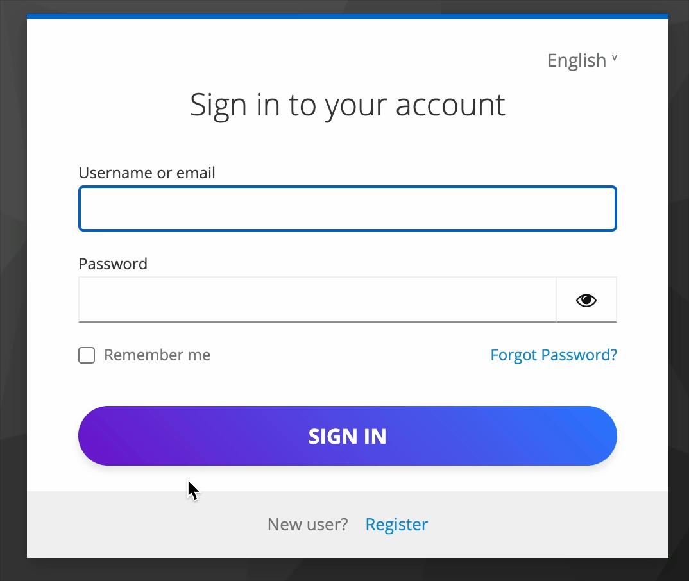

# CSS Customization


This page is a must-read. Even if you plan to redesign the pages at the component level, you should at least understand how to remove the default CSS styles.


## Understanding the CSS class system

When you inspect the DOM in Storybook, you’ll notice most elements have at least a couple of classes applied to them:

* A class starting with `kc`, for example `kcLabelClass`.
* One or more classes starting with `pf-`, for example `pf-c-form__label`, `pf-c-form__label-text`.

<figure><figcaption><p>Inspecting an input label on the login page</p></figcaption></figure>

Classes beginning with `kc` don’t have any styles applied to them by default. Their sole purpose is to serve as selectors for your custom styles.

Classes beginning with `pf-` are Patternfly classes. [Patternfly](https://v5-archive.patternfly.org/) is a CSS framework created by RedHat, similar to Bootstrap, that the Keycloak team uses to build all of its UIs. &#x20;

What you’ll want to do is partially or completely remove the Patternfly styles and then apply your custom ones.

## Applying your custom CSS


Do not edit any file in the `public/keycloakify-dev-resources` directory. These files are used by Storybook to simulate a Keycloak environment during development, and they aren't part of your actual theme.


To apply your custom CSS style, use the `kc` classes to target the components.


```css
.kcLabelClass {
   border: 3px solid red;
}
```




<pre class="language-tsx" data-title="src/login/KcApp.tsx"><code class="lang-tsx"><strong>import "./main.css";
</strong>// ...
</code></pre>



<pre class="language-html" data-title="src/login/KcPage.svelte"><code class="lang-html">&#x3C;script lang="ts">
<strong>  import "./main.css";
</strong>  import Template from '@keycloakify/svelte/login/Template.svelte';
  ...
</code></pre>



<pre class="language-typescript" data-title="src/login/KcPage.ts"><code class="lang-typescript"><strong>import "./main.css";
</strong>import { getDefaultPageComponent, type KcPage } from '@keycloakify/angular/login';
// ...
</code></pre>



This is the result:

<figure><figcaption><p>A red border has been applied to every input label</p></figcaption></figure>

<details>

<summary>Having different stylesheets for the login page, the register page, etc...</summary>

Here, we used a global stylesheet that applies to all pages of the login theme. However, you can also apply different stylesheets on a page-by-page basis (one for the login page, another one for the register page, etc...).

If you plan to customize the pages using React/Angular/Svelte at the component level, it will be very clear how to do so after reading the [using a component library page](common-use-case-examples/using-a-component-library.md).

However, if you plan to only customize with CSS, it might not be immediately obvious. Below is [a snippet of React code](#user-content-fn-1)[^1] showing how you can achieve separate stylesheets:


```tsx
import {
    Suspense, 
    lazy,
    useMemo
} from "react";

export default function KcPage(props: { kcContext: KcContext }) {
    const { kcContext } = props;

    const { i18n } = useI18n({ kcContext });

    const classes = useCustomStyles(kcContext);

    return (
        <Suspense>
            {(() => {
                switch (kcContext.pageId) {
                    default:
                        return (
                            <DefaultPage
                                kcContext={kcContext}
                                i18n={i18n}
                                classes={classes}
                                Template={Template}
                                doUseDefaultCss={true}
                                UserProfileFormFields={UserProfileFormFields}
                                doMakeUserConfirmPassword={doMakeUserConfirmPassword}
                            />
                        );
                }
            })()}
        </Suspense>
    );
}

function useCustomStyles(kcContext: KcContext) {
    return useMemo(() => {
        
        // Your stylesheet that applies to all pages.
        import("./main.css");
        let classes: { [key in ClassKey]?: string } = {
            // Classes that apply to all pages
        };

        switch (kcContext.pageId) {
            case "login.ftl":
                // A login page-specific stylesheet.
                import("./pages/login.css");
                classes = {
                    ...classes,
                    // Classes that apply only to the login page
                };
                break;
            case "register.ftl":
                // A register page-specific stylesheet.
                import("./pages/register.css");
                classes = {
                    ...classes,
                    // Classes that apply only to the register page
                };
                break;
            // ...
        }

        return classes;

    }, []);
}
```


If this code doesn’t make much sense, you can watch [this video tutorial](https://www.youtube.com/watch?v=Nkoz1iD-HOA) where this approach is demonstrated in practice.

</details>

<details>

<summary>Using Tailwind</summary>

Of course, you can use Tailwind in the usual way by applying utility classes to the React/Angular/Svelte components.\
But note that you can also use Tailwind without modifying the page structure by using the `@apply` directive. This is shown in [this page](css-customization.md#using-tailwind).

</details>

<details>

<summary>Using Bootstrap or some other CSS framework</summary>

If you want to use Bootstrap or another CSS framework that provides standardized classes, you might wonder how to apply these classes.\
\
Here’s an example with Bootstrap:

```bash
yarn add bootstrap
```

<pre class="language-tsx" data-title="src/login/KcPage.tsx"><code class="lang-tsx"><strong>import "bootstrap/dist/css/bootstrap.min.css";
</strong>import { Suspense, lazy } from "react";
import type { ClassKey } from "keycloakify/login";
import type { KcContext } from "./KcContext";
import { useI18n } from "./i18n";
import DefaultPage from "keycloakify/login/DefaultPage";
import Template from "keycloakify/login/Template";
const UserProfileFormFields = lazy(
    () => import("keycloakify/login/UserProfileFormFields")
);

const doMakeUserConfirmPassword = true;

export default function KcPage(props: { kcContext: KcContext }) {
    const { kcContext } = props;

    const { i18n } = useI18n({ kcContext });

    return (
        &#x3C;Suspense>
            {(() => {
                switch (kcContext.pageId) {
                    default:
                        return (
                            &#x3C;DefaultPage
                                kcContext={kcContext}
                                i18n={i18n}
                                classes={classes}
                                Template={Template}
                                doUseDefaultCss={true}
                                UserProfileFormFields={UserProfileFormFields}
                                doMakeUserConfirmPassword={doMakeUserConfirmPassword}
                            />
                        );
                }
            })()}
        &#x3C;/Suspense>
    );
}

const classes = {
<strong>    kcLabelClass: "form-label col-form-label",
</strong>} satisfies { [key in ClassKey]?: string };
</code></pre>

By doing this, you replace the Patternfly classes `pf-c-form__label pf-c-form__label-text` with the Bootstrap classes `form-label col-form-label`.

In practice, if you inspect the element in your browser, the form label that was previously rendered as:

```html
<label for="username" class="kcLabelClass pf-c-form__label pf-c-form__label-text">
```

Is now rendered as:

```html
<label for="username" class="kcLabelClass form-label col-form-label">
```

</details>

## Removing Some of the Default Styles

Let’s consider the **Sign In** button on the login page:

<figure><figcaption><p>The default look of the "Sign In" button</p></figcaption></figure>

Here’s how we can “unstyle” it so that we can apply custom styles without worrying about conflicts from the default Patternfly styles:

<figure><figcaption><p>How the "Sign In" button looks when all Patternfly styles are removed</p></figcaption></figure>

To remove the Patternfly styles, inspect the button in your browser:

<figure><figcaption><p>Inspecting the CSS classes applied to the "Sign In" button</p></figcaption></figure>

We can see which Patternfly classes are applied by default to the standardized element:

* `kcButtonClass` -> `pf-c-button`
* `kcButtonPrimaryClass` -> `pf-m-primary` and `long-pf-btn`
* `kcButtonBlockClass` -> `pf-m-block`
* `kcButtonLargeClass` -> `btn-lg`

Since we want to remove all the default styles, we can tell Keycloakify to remove all classes assigned by default to these `kc` classes:



<pre class="language-tsx" data-title="src/login/KcPage.tsx"><code class="lang-tsx">// ...

const classes = {
<strong>    kcButtonClass: "",
</strong><strong>    kcButtonPrimaryClass: "",
</strong><strong>    kcButtonBlockClass: "",
</strong><strong>    kcButtonLargeClass: ""
</strong>} satisfies { [key in ClassKey]?: string };
</code></pre>



<pre class="language-typescript" data-title="src/login/KcPage.ts"><code class="lang-typescript">const classes = {
<strong>    kcButtonClass: "",
</strong><strong>    kcButtonPrimaryClass: "",
</strong><strong>    kcButtonBlockClass: "",
</strong><strong>    kcButtonLargeClass: ""
</strong>} satisfies { [key in ClassKey]?: string };
</code></pre>



<pre class="language-html" data-title="src/login/KcPage.svelte"><code class="lang-html">&#x3C;script lang="ts">
// ...

const classes = {
<strong>    kcButtonClass: "",
</strong><strong>    kcButtonPrimaryClass: "",
</strong><strong>    kcButtonBlockClass: "",
</strong><strong>    kcButtonLargeClass: ""
</strong>} satisfies { [key in ClassKey]?: string };
</code></pre>




After saving these changes, here’s the result:

<figure><figcaption><p>All Patternfly classes have been stripped out, restoring the button to its default HTML style.</p></figcaption></figure>

Now you can freely apply your own custom button styles without Patternfly interfering.

<figure><figcaption><p>Button with custom style</p></figcaption></figure>

<details>

<summary>Reveal custom CSS code for this custom button</summary>


```css
.kcButtonClass {
    padding: 10px 20px;
    font-size: 16px;
    font-weight: bold;
    text-transform: uppercase;
    color: #ffffff;
    background: linear-gradient(45deg, #6a11cb, #2575fc);
    border: none;
    border-radius: 25px;
    box-shadow: 0 4px 6px rgba(0, 0, 0, 0.1);
    transition: transform 0.2s, box-shadow 0.2s;
    cursor: pointer;
    width: 100%;
}

.kcButtonClass:hover {
    transform: translateY(-2px);
    box-shadow: 0 6px 8px rgba(0, 0, 0, 0.2);
}

.kcButtonClass:active {
    transform: translateY(0);
    box-shadow: 0 2px 4px rgba(0, 0, 0, 0.2);
}

.kcButtonClass:focus {
    outline: none;
    box-shadow: 0 0 0 3px rgba(37, 117, 252, 0.5);
}
```


</details>

## Remove All the Default Styles

You may prefer to remove all Patternfly styles altogether and start fresh.

<figure><figcaption><p>The login page completely unstyled (doUseDefaultCss set to false).</p></figcaption></figure>

A benefit of this approach is that not only are all `pf-` classes stripped out in one go, but the global Patternfly stylesheet isn’t even loaded.



<pre class="language-tsx" data-title="src/login/KcPages.tsx"><code class="lang-tsx">// ...
&#x3C;DefaultPage
    kcContext={kcContext}
    i18n={i18n}
    classes={classes}
    Template={Template}
<strong>    doUseDefaultCss={false}
</strong>    UserProfileFormFields={UserProfileFormFields}
    doMakeUserConfirmPassword={doMakeUserConfirmPassword}
/>
</code></pre>



<pre class="language-html" data-title="src/login/KcPage.svelte"><code class="lang-html">{#await page() then { default: Page }}
    &#x3C;Page
      {kcContext}
      i18n={i18n}
      {classes}
      {Template}
      {UserProfileFormFields}
<strong>      doUseDefaultCss={false}
</strong>      {doMakeUserConfirmPassword}
    >&#x3C;/Page>
{/await}
</code></pre>



<pre class="language-typescript" data-title="src/login/KcPage.ts"><code class="lang-typescript">const classes = {} satisfies { [key in ClassKey]?: string };
<strong>const doUseDefaultCss = false;
</strong>const doMakeUserConfirmPassword = true;

export async function getKcPage(pageId: KcContext['pageId']): Promise&#x3C;KcPage> {
  switch (pageId) {
    default:
      return {
        PageComponent: await getDefaultPageComponent(pageId),
        TemplateComponent,
        UserProfileFormFieldsComponent,
        doMakeUserConfirmPassword,
        doUseDefaultCss,
        classes,
      };
  }
}
</code></pre>



### Disabling the default styles only on some pages

A common scenario is using [`npx keycloakify eject-page`](common-use-case-examples/using-a-component-library.md) to customize only certain pages of the login UI in depth.

For pages you've ejected, you’ll likely want to disable all default styles; however, you might prefer to keep the Patternfly styles on the pages you haven't redesigned.\
Below is an example where `login.ftl` has been ejected and its default styles are disabled, while the other pages remain styled:



<pre class="language-tsx" data-title="src/login/KcPages.tsx"><code class="lang-tsx">switch (kcContext.pageId) {
    case "login.ftl":
        return (
            &#x3C;Login
                {...{ kcContext, i18n, classes }}
                Template={Template}
<strong>                doUseDefaultCss={false}
</strong>            />
        );
    default:
        return (
            &#x3C;DefaultPage
                kcContext={kcContext}
                i18n={i18n}
                classes={classes}
                Template={Template}
<strong>                doUseDefaultCss={true}
</strong>                UserProfileFormFields={UserProfileFormFields}
                doMakeUserConfirmPassword={doMakeUserConfirmPassword}
            />
        );
}
</code></pre>



<pre class="language-typescript" data-title="src/login/KcPage.ts"><code class="lang-typescript">  switch (pageId) {
    case 'login.ftl':
      return {
        PageComponent: (await import('./pages/login/login.component')).LoginComponent,
        TemplateComponent,
        UserProfileFormFieldsComponent,
        doMakeUserConfirmPassword,
<strong>        doUseDefaultCss: false,
</strong>        classes,
      };
    default:
      return {
        PageComponent: await getDefaultPageComponent(pageId),
        TemplateComponent,
        UserProfileFormFieldsComponent,
        doMakeUserConfirmPassword,
<strong>        doUseDefaultCss: true,
</strong>        classes,
      };
  }
</code></pre>



<pre class="language-html" data-title="src/login/KcPage.svelte"><code class="lang-html">&#x3C;script lang="ts">
  // ...
<strong>  const doUseDefaultCss = (()=>{
</strong><strong>    switch(kcContext.pageId){
</strong><strong>      case "login.ftl": return false;
</strong><strong>      default: return true;
</strong><strong>    }
</strong><strong>  })();
</strong>  
  const page = async (): Promise&#x3C;{ default?: Component&#x3C;any> }> => {
    switch (kcContext.pageId) {
      case 'login.ftl':
        return import('./pages/Login.svelte"');
      default:
        return import('@keycloakify/svelte/login/DefaultPage.svelte');
    }
  };
&#x3C;/script>

{#await page() then { default: Page }}
    &#x3C;Page
      {kcContext}
      i18n={i18n}
      {classes}
      {Template}
      {UserProfileFormFields}
<strong>      {doUseDefaultCss}
</strong>      {doMakeUserConfirmPassword}
    >&#x3C;/Page>
{/await}
</code></pre>



### Removing the classes in ejected components (kcClsx)

If you have ejected some pages with [`npx keycloakify eject-page`](common-use-case-examples/using-a-component-library.md) and disabled the default styles by setting `doUseDefaultCss` to `false`, you might wonder if you need to keep the `kcClsx` in the pages. For example:

<pre class="language-tsx" data-title="src/login/pages/Login.tsx"><code class="lang-tsx">&#x3C;input
    tabIndex={7}
    disabled={isLoginButtonDisabled}
<strong>    className={kcClsx(
</strong><strong>        "kcButtonClass", 
</strong><strong>        "kcButtonPrimaryClass", 
</strong><strong>        "kcButtonBlockClass", 
</strong><strong>        "kcButtonLargeClass"
</strong><strong>    )}
</strong>    name="login"
    id="kc-login"
    type="submit"
    value={msgStr("doLogIn")}
/>
</code></pre>

The short answer is no; feel free to remove them.

Just be aware that if you have defined any custom CSS targeting those classes (for example `.kcButtonClass { /* ... */ }`), they will no longer apply once you remove the classes.

[^1]: If you’re using Angular or Svelte, you likely plan on customizing pages at the component level, so this may not be relevant to you.
